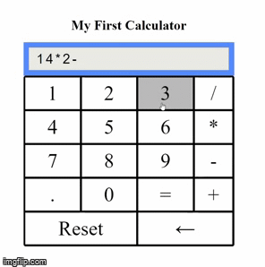

# Basic Calculator

## Description

Basic calculator created using HTML, CSS and vanilla JavaScript.

* Can Add, Substruct, Divide and Multiply.
* Can calculate multiple operators expressions.
* Takes into account operators' mathematical order.